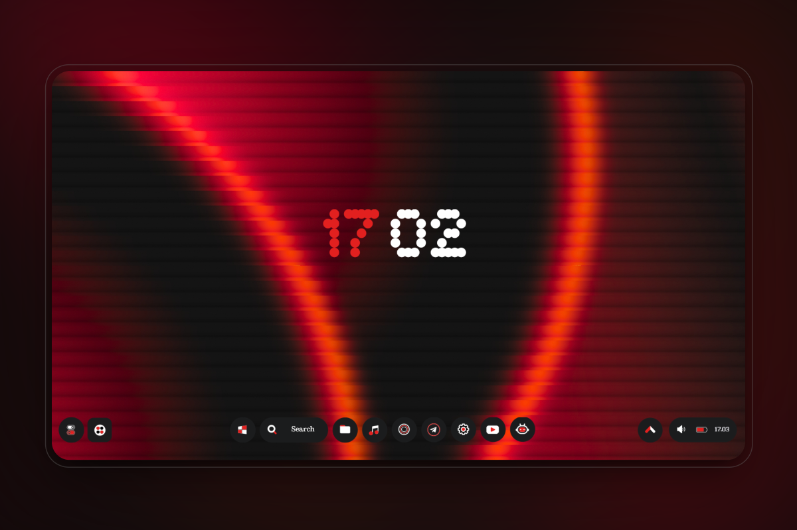
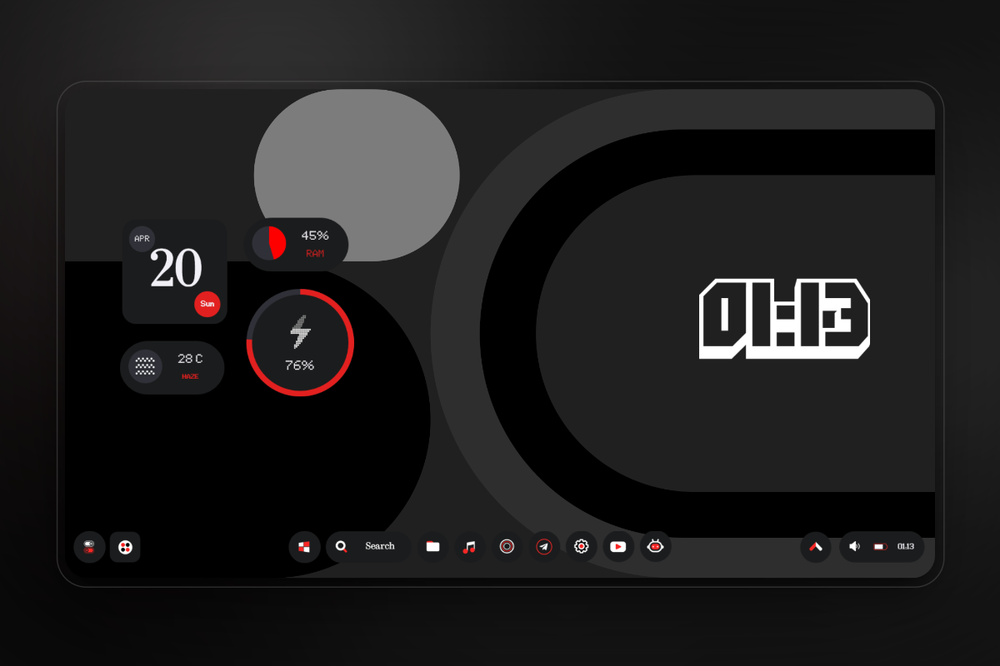
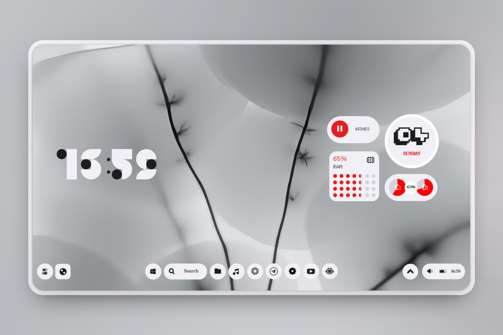
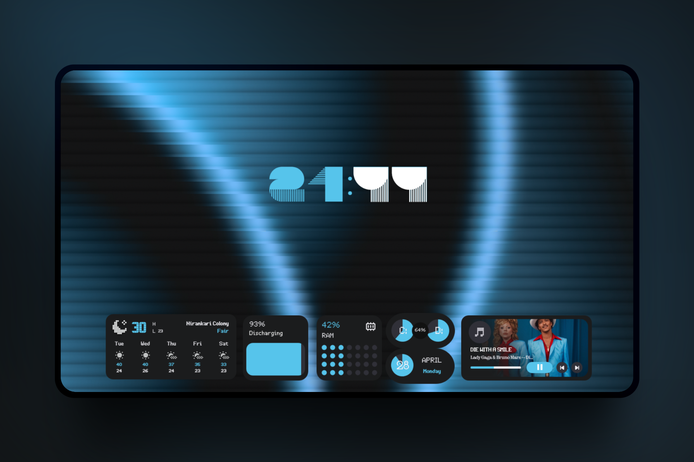
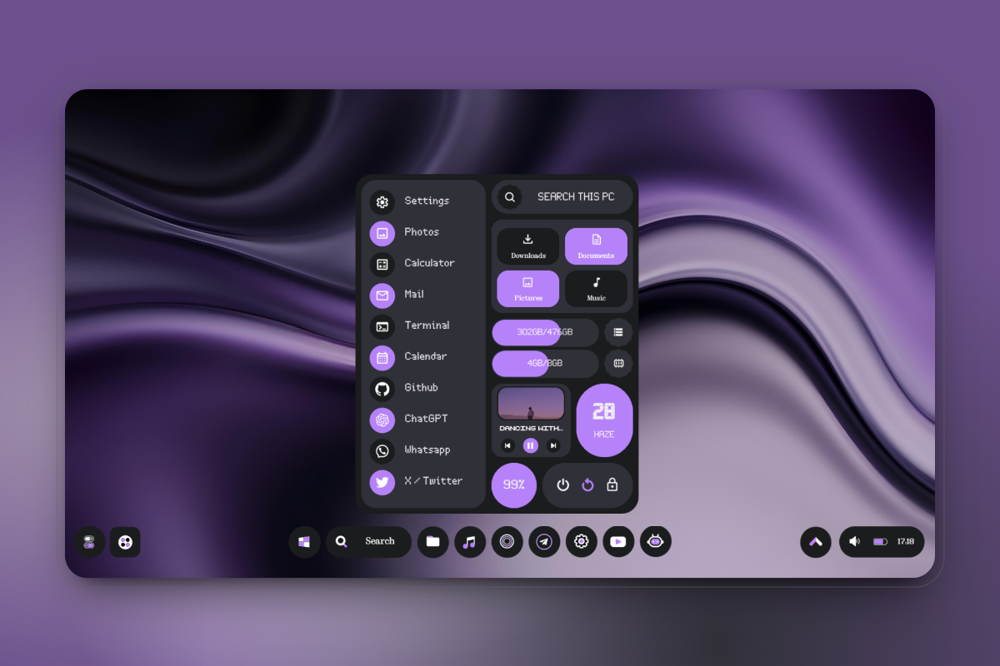
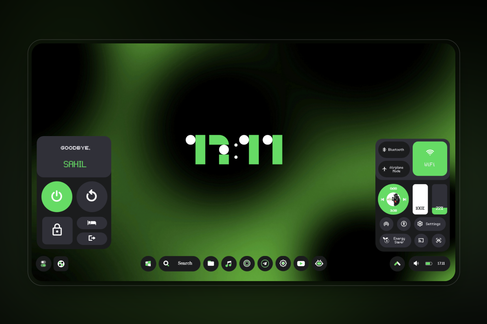
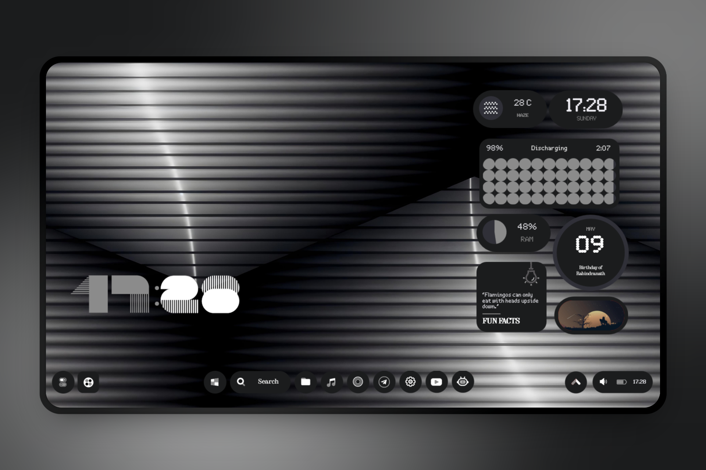
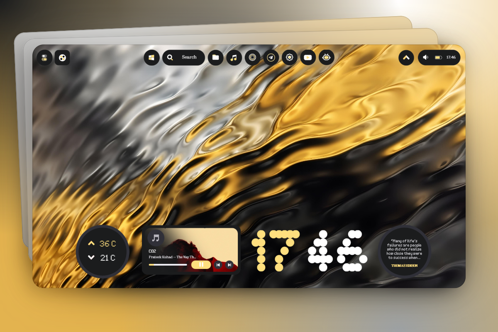
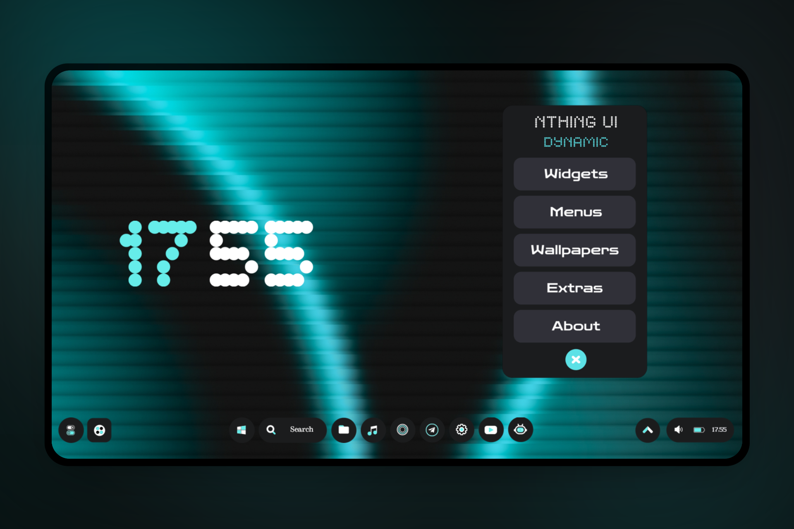

 <h1 align="center">NThing UI</h1>

  A rainmeter based project featuring NothingOS inspired widgets, taskbar, menus and more for your Windows desktops. Works on Windows 7 and above. 

<h3 align="center">
<a href="https://github.com/zamansheikh/NThing-UI/releases/latest">Download NThing UI</a>
   

 <a href="https://github.com/zamansheikh/NThing-UI/releases/latest">Download NThing UI</a>
 

   

  
  
  
 

  <a href="https://t.me/zamansheikh">
    

  

    </a>

# Features of NThing UI

- **Clock:** Shows time of your region with 6 different styles.
- **Date:** Shows current date with 3 different styles.
- **Weather:** Shows weather of your location with 4 different styles.
- **Music:** Displays current music playing along with album art, song and artist name with 4 different styles.
- **Battery:** Displays current battery level of your pc, along with some more battery related info with 4 different styles.
- **Events:** Shows upcoming holiday events along with their dates and time with 4 different styles.
- **Monitor:** Shows status of RAM, CPU, HDD and SWAP memory with 7 different styles.
- **Photos:** Slideshow of all random photos from your chosen photo library/folder with 4 different styles.
- **Quotes & Facts:** Shows random quotes & facts to motivate you & brainstorm your knowledge with 2 different styles.
- **Taskbar:** A custom NothingOS inspired taskbar to fit the overall aesthetics.
- **Start Menu:** A custom NothingOS start menu to replace boring default one.
- **Power Menu:** A custom NothingOS power menu to ease out your way to shut down computer.
- **Tools Menu:** A custom NothingOS tools menu with useful quick tiles/settings replacing your windows+A key.
- **Wallpapers:** 30 exclusive NothingOS inspired wallpapers.
- **Dynamic Theme:** A custom dynamic theme which auto adapts to your wallpaper color.

# Screenshots

  
  
  
  
  
  
  
  
  	

# Important Notes

- Notes related to widgets and taskbar are shared in txt file inside the zip, do read them before installing skin.
     
- **Sizing**: DO NOT TRY TO RESIZE WIDGETS BY EDITING SKIN FILES OR VARIABLE FILES, THIS MAY BREAK YOUR WIDGET.

# Installation

1. Install/ Update [Rainmeter for Windows](https://www.rainmeter.net/).
2. Download the [latest release of NThing UI](https://github.com/zamansheikh/NThing-UI/releases/latest).
3. Double click the downloaded `.rmskin` file and it should open the skin install dialog.
   > If you have a portable Rainmeter install, your file may not open by default by the skin installer. If so, open the `.rmskin` file with the `SkinInstaller.exe` file in the Rainmeter install directory. 
   > 

4. Continue with on screen options and you are done! In case your skin didn't load on install, open Rainmeter skin manager and manually load the skin and layouts.
   > 

# Credits
1. [Gadgets by SilverAzide](https://github.com/SilverAzide/Gadgets) for Weather widgets.
2. Rainmeter forum community to help fix some issues.
3. A bit of google and AI for ideas and suggestions.
4. All testers for early testing of the project.

# Feedback 
If you find any bugs or want to add suggestions, please open a new [issue](https://github.com/zamansheikh/NThing-UI/issues/new) or text me on Telegram [@ZamanSheikh](https://t.me/ZamanSheikh)

**Do star this repo to show your support and share as well, means a lot**. Thanks, see yaa 💝

	

